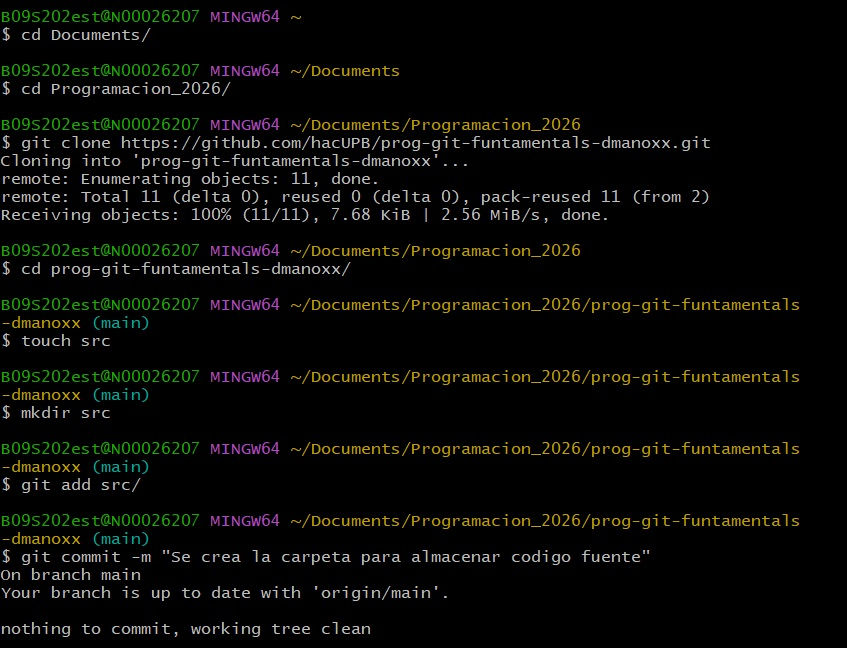
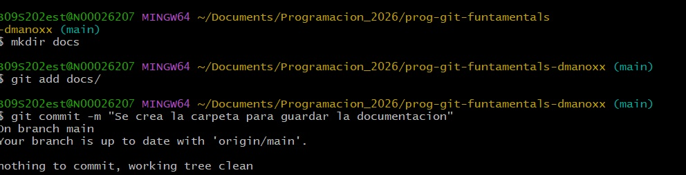
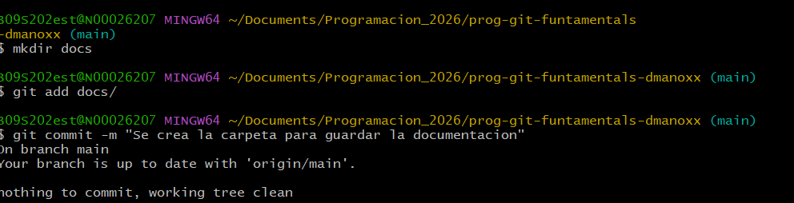
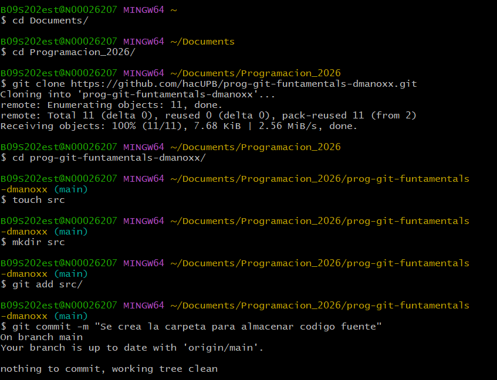
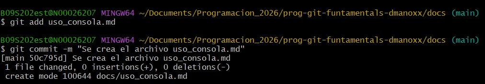

# Uso de la consola

## Introducción

La consola o terminal es una herramienta que permite interactuar con el sistema operativo mediante comandos de texto. En esta unidad se aprendió a utilizar la consola para navegar por el sistema de archivos y crear directorios y archivos.

## Navegación entre directorios

Algunos comandos utilizados para navegar son:

- `pwd`: muestra la ruta del directorio actual.
- `ls`: lista los archivos y carpetas del directorio.
- `cd nombre_directorio`: permite ingresar a un directorio.
- `cd ..`: vuelve al directorio anterior.

 
## Creación de directorios y archivos

Comandos para crear archivos y carpetas:

- `mkdir nombre_carpeta`: crea una carpeta.
- `touch nombre_archivo`: crea un archivo vacío.
- `code .`: abre el proyecto en Visual Studio Code (si está configurado).

## Otros comandos importantes

- `clear`: limpia la consola.

## Evidencia visual

A continuación se pueden agregar pantallazos del uso de comandos como:
- Creación de carpetas con `mkdir`
- Navegación con `cd`

